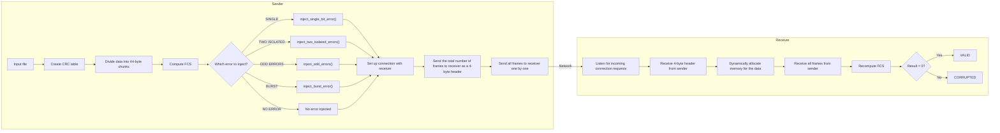

# Computer Networks Lab Report

<table>
<tr>
<td><strong>Name:</strong> Ahnik Sarkar</td>
<td><strong>Roll No:</strong> 002410501021</td>
<td><strong>Class:</strong> BCSE-III</td>
<td><strong>Assignment Number:</strong> 1</td>
</tr>
</table>

<p><strong>Problem Statement:</strong><br>
Design and implementation of an error detection module which has two schemes — Checksum and Cyclic Redundancy Check (CRC).
</p>

---

## 1. Design

### 1.1 Purpose

The purpose of this program is to implement and evaluate the error detection schemes - **16-bit Checksum** and **Cyclic Redundancy Check** on a simulated noisy network and to measure the performance and accuracy of the various error detection schemes. The system uses POSIX sockets for communication. The system consists of :

- **Sender** - Reads an input file, chunks it into fixed-sized frames of 64 bytes, computes a Frame Check Sequence (FCS) using one of the error detection schemes, injects a randomly chosen error into each frame and transmits the frames to the receiver over a TCP socket.
- **Receiver** - Listens on a TCP port, accepts incoming connections from senders and receives frames from the senders. It then checks for errors in the frames using the FCS in the trailer of the frames and prints whether the frame is VALID or CORRUPTED.
- **Error Injector Module** - Module containing the logic for injecting one of the following types of errors - single-bit errors, two isolated single-bit errors, odd errors and burst errors.
- **CRC** - Module containing logic for calculating CRC-8, CRC-10, CRC-16 and CRC-32 of the payload and header of each frame, including logic for setting up CRC lookup tables for making CRC calculations faster.
- **Evaluator** - Another sender program which injects three specific types of errors alternatively - (i) error detected by both CRC and checksum, (ii) error detected by checksum but not by CRC, (iii) error detected by CRC but not by checksum.

### 1.2 Structure

The project is organized into header files (for function declarations) and source files (for implementations).

**Project Directory:**
```
assignment-1/
├── include/
│   ├── common.h                # Common macros, struct and function declarations
│   ├── crc.h                   # CRC and CRC look-up table function declarations
│   └── error_injector.h        # Error-injection function declarations
├── src/
│   ├── sender.c                # Sender program
│   ├── receiver.c              # Receiver program
│   ├── evaluator.c             # Sender program for evaluation of errors
│   ├── common.c                # Implementation of common functions
│   ├── crc.c                   # CRC-8, CRC-10, CRC-16, CRC-32 implementations along with CRC tables
│   └── error_injector.c        # Error injection function implementations
├── bin/                        # Compiled binaries and object files
├── logs/                       # Output logs from sender and receiver (for accuracy analysis)
├── tests/                      # All test files
├── Makefile                    # Build system
├── run_tests.sh                # Bash script for running performance tests for a given error detection scheme
├── run_all_tests.sh            # Bash script for running performance tests for all error detection schemes
├── analyze_evaluator_logs.py   # Python script to generate statistics for the evaluator
└── analyze_logs.py             # Python script to generate statistics on the accuracy of each of the schemes
```

**Data Flow:**



### 1.3 Frame Structure

The frame is a fixed-size 64-byte struct. Compiler-level struct packing is used to prevent any padding bytes, so the struct has the same binary layout on all platforms.

The frame consists of three parts: header, payload and trailer.
```c
#define FRAME_SIZE       64        // Size of frame in bytes
#define MAC_ADDRESS_SIZE  6        // Size of MAC address in bytes
#define HEADER_SIZE       4        // Size of the header containing length

#pragma pack(push, 1)
typedef struct {
    uint8_t  sender_addr[MAC_ADDRESS_SIZE];     // Sender address
    uint8_t  receiver_addr[MAC_ADDRESS_SIZE];   // Receiver address
    uint16_t length;                            // The length of the payload
    uint16_t type;                              // The type of error detection used
} Header;
#pragma pack(pop)

#pragma pack(push, 1)
typedef union {
    uint8_t crc[4];         // CRC bits
    uint16_t checksum;      // Checksum bits
} Trailer;
#pragma pack(pop)

#define ERROR_RANGE (FRAME_SIZE - sizeof(Trailer))
#define PAYLOAD_SIZE (FRAME_SIZE - sizeof(Header) - sizeof(Trailer))

#pragma pack(push, 1)
typedef struct {
    Header header;
    uint8_t payload[PAYLOAD_SIZE];  // The actual payload buffer
    Trailer trailer;
} Frame;
#pragma pack(pop)
```

### 1.4 Running The Programs
For compiling and running the receiver:
```text
make receiver
```

For compiling and running the sender:
```test
make sender ARGS="<scheme> <ip address> <test file>"
```

For compiling and running the evaluator:
```test
make evaluator ARGS="<scheme> <ip address> <test file>"
```

### 1.5 Output
Receiver output:
```text
--- FRAME #<frame_num> ---
<scheme>: <VALID/CORRUPTED>
```

Sender output:
```text
--- FRAME #<frame_num> ---
ERROR: <type of error>
```

## 2. Implementation

### 2.1 Checksum-16

The checksum is calculated by treating the input data as a sequence of 16-bit data words, adding up all the data words in a 16-bit accumulator. If carry is detected, then it is added to the sum. Finally, we take one's complement of the sum to get the result.
```c
uint16_t find_checksum(const uint16_t *buffer, size_t length) {
    uint16_t sum = 0;
    uint16_t carry = 0;
    uint16_t next_carry = 0;

    for (size_t i = 0; i < length; i++) {
        next_carry = 0;
        if (sum > UINT16_MAX - htons(buffer[i]) - carry)
            next_carry = 1;
        sum += htons(buffer[i]) + carry;
        carry = next_carry;
    }
    sum += carry;

    return ~sum;
}
```

### 2.2 CRC Implementations

CRC calculator is implemented using bitwise polynomial long division by using a CRC shift register. CRC for the header and payload is calculated byte-wise. For each byte, in each step, the most significant bit of the byte is checked and the byte is left-shifted by one. If the MSB is 1, then the byte is XORed with the generator polynomial after left shift. In order to further optimise CRC calculation, CRC for each of the 256 possible bytes are precomputed and stored in a lookup table and are used for computing CRC for the frame.

Creating CRC lookup tables:
```c
void create_crc8_table() {
    for (uint16_t i = 0; i < CRC_TABLE_SIZE; i++) {
        uint8_t reg = (uint8_t) i;
        for (int j = 0; j < 8; j++) {
            if (reg & 0x80)
                reg = (reg << 1) ^ CRC8_GENERATOR;
            else
                reg <<= 1;
        }
        crc8_table[i] = reg;
    }
}

void create_crc10_table() {
    for (uint16_t i = 0; i < CRC_TABLE_SIZE; i++) {
        uint16_t reg = i << 2;
        for (int j = 0; j < 8; j++) {
            if (reg & 0x0200)
                reg = (reg << 1) ^ CRC10_GENERATOR;
            else
                reg <<= 1;
        }
        crc10_table[i] = reg & 0x03FF;
    }
}

void create_crc16_table() {
    for (uint16_t i = 0; i < CRC_TABLE_SIZE; i++) {
        uint16_t reg = i << 8;
        for (int j = 0; j < 8; j++) {
            if (reg & 0x8000)
                reg = (reg << 1) ^ CRC16_GENERATOR;
            else
                reg <<= 1;
        }
        crc16_table[i] = reg;
    }
}

void create_crc32_table() {
    for (uint32_t i = 0; i < CRC_TABLE_SIZE; i++) {
        uint32_t reg = i << 24;
        for (int j = 0; j < 8; j++) {
            if (reg & 0x80000000)
                reg = (reg << 1) ^ CRC32_GENERATOR;
            else
                reg <<= 1;
        }
        crc32_table[i] = reg;
    }
}
```

Calculating CRC with the help of lookup tables:
```c
uint8_t compute_crc8(const uint8_t *buffer, size_t size) {
    if (buffer == NULL) return 0;
    uint8_t crc = 0;
    for (size_t i = 0; i < size; i++) {
        uint8_t pos = crc ^ buffer[i];
        crc = crc8_table[pos];
    }
    return crc;
}

uint16_t compute_crc10(const uint8_t *buffer, size_t size) {
    if (buffer == NULL) return 0;
    uint16_t crc = 0;
    for (size_t i = 0; i < size; i++) {
        uint8_t pos = (uint8_t) (crc >> 2) ^ buffer[i];
        crc = (crc << 8) ^ crc10_table[pos];
    }
    crc = crc & 0x03FF;
    return crc;
}

uint16_t compute_crc16(const uint8_t *buffer, size_t size) {
    if (buffer == NULL) return 0;
    uint16_t crc = 0;
    for (size_t i = 0; i < size; i++) {
        uint8_t pos = (uint8_t) (crc >> 8) ^ buffer[i];
        crc = (crc << 8) ^ crc16_table[pos];
    }
    return crc;
}

uint32_t compute_crc32(const uint8_t *buffer, size_t size) {
    if (buffer == NULL) return 0;
    uint32_t crc = 0;
    for (size_t i = 0; i < size; i++) {
        uint8_t pos = (uint8_t) (crc >> 24) ^ buffer[i];
        crc = (crc << 8) ^ crc32_table[pos];
    }
    return crc;
}
```

An alternative implementation for CRC calculation is used for comparing perfomance improvement with the lookup table approach as shown by the implemenation of CRC-32:
```c
uint32_t compute_crc32(const uint8_t *buffer, size_t size) {
    if (buffer == NULL) return 0;
    uint32_t crc = 0;
    for (size_t i = 0; i < size; i++) {
        uint32_t byte = (uint32_t) buffer[i];
        crc ^= byte << 24;
        for (int j = 0; j < 8; j++) {
            if (crc & 0x8000000)
                crc = (crc << 1) ^ CRC32_GENERATOR;
            else
                crc <<= 1;
        }
    }
    return crc;
}
```

The generator polynomials used are:
```c
// CRC generators
#define CRC8_GENERATOR  0x07
#define CRC10_GENERATOR 0x0233
#define CRC16_GENERATOR 0x1021
#define CRC32_GENERATOR 0x04C11DB7
```

### 2.3 Error Injector Functions

The error injector module (error_injector.c) implements four types of generic error types to be injected at random:
- Single-bit error (a bit in the frame is picked at random and inverted)
```c
void inject_single_bit_error(uint8_t *buffer, unsigned int size) {
    unsigned int pos = rand() % (size << 3);
    buffer[pos >> 3] ^= 1 << (pos % 8);
}
```

- Two isolated single-bit errors (two bits in the frame are picked at random and inverted)
```c
void inject_two_isolated_error(uint8_t *buffer, unsigned int size) {
    int m = rand() % (size << 3);
    int n = m;
    while (abs(m - n) < 2) n = rand() % (size << 3);
    buffer[m >> 3] ^= 1 << (m % 8);
    buffer[n >> 3] ^= 1 << (n % 8);
}
```

- Odd errors (3, 5 or 7 bits in the frame are chosen at random and inverted)
```c
void inject_odd_errors(uint8_t *buffer, unsigned int size) {
    unsigned int no_of_errors = ((rand() % 3) * 2) + 3;
    for (unsigned int i = 0; i < no_of_errors; i++) {
        unsigned int pos = rand() % (size << 3);
        buffer[pos >> 3] ^= 1 << (pos % 8);
    }
}
```

- Burst error (3 to 34 consecutive bits are inverted from a random starting location)
```c
void inject_burst_error(uint8_t *buffer, unsigned int size) {
    unsigned int no_of_errors = (rand() % 32) + 3;
    unsigned int start = rand() % (size << 3);
    for (unsigned int i = 0; i < no_of_errors; i++) {
        unsigned int pos = start + i;
        if (pos >= (size << 3)) break;
        buffer[pos >> 3] ^= 1 << (pos % 8);
    }
}
```

### 2.4 Sender Program

The sender (`sender.c`) follows the following steps:

1. Parses the command-line arguments for error detection code, receiver IP address and the input file.
2. Creates lookup table if CRC is used.
3. Divides the file into chunks of size 44 bytes adding padding to the last chunk if necessary.
4. Compute FCS using the scheme provided.
5. Randomly select an error and inject it into each of the frames (some frames may also be injected with no error in random chance).
6. Set up receiver socket and connect to the receiver IP address and port.
7. Send the total number of frames generated as a 4 byte header in network byte order for the receiver to pick up and allocate memory.
8. Send each of the frames one by one.
```c
// Create the socket to communicate with the receiver
    int receiver_socket;
    if ((receiver_socket = socket(AF_INET, SOCK_STREAM, 0)) < 0)
        exit_with_error("Failed to create socket!");

    // Initialize the fill up the receiver address struct
    struct sockaddr_in receiver_addr;
    memset(&receiver_addr, 0, sizeof(receiver_addr));
    receiver_addr.sin_family = AF_INET;
    receiver_addr.sin_port   = htons(RECEIVER_PORT);

    if (inet_pton(AF_INET, argv[2], &receiver_addr.sin_addr) <= 0)
        exit_with_error("inet_pton error for %s!", argv[1]);

    // Try to connect to the receiver
    if (connect(receiver_socket, (struct sockaddr *) &receiver_addr, (socklen_t) sizeof(receiver_addr)) < 0)
        exit_with_error("Connection failed!");

    // Send the header containing total number of frames in the message
    uint32_t net_length = htonl(total_frames);
    uint8_t *buffer_ptr = (uint8_t *) &net_length;
    ssize_t total_bytes_sent = 0;
    while (total_bytes_sent < HEADER_SIZE) {
        ssize_t bytes_sent = send(receiver_socket, buffer_ptr + total_bytes_sent, HEADER_SIZE - total_bytes_sent, 0);
        if (bytes_sent < 0)
            exit_with_error("Send Failed!");
        total_bytes_sent += bytes_sent;
    }

    // Sending the total message to the receiver
    total_bytes_sent = 0;
    ssize_t total_size = total_frames * FRAME_SIZE;
    buffer_ptr = (uint8_t *) frame_buffer;
    while (total_bytes_sent < total_size) {
        ssize_t bytes_sent = send(receiver_socket, buffer_ptr + total_bytes_sent, total_size - total_bytes_sent, 0);
        if (bytes_sent < 0)
            exit_with_error("Send Failed!");
        total_bytes_sent += bytes_sent;
    }
    close(receiver_socket);
    free(frame_buffer);
```

### 2.5 Receiver Program

The receiver (`receiver.c`) follows the following steps:

1. Creates lookup tables for all the CRC error detection schemes.
2. Sets up receiver socket, sets it to be reusable, binds it to the receiver port and sets the socket as a listening socket.
3. Executes an infinite while loop in which the socket listens for incoming sender connection requests.
4. On connection request, the receiver creates a sender socket to communicate with the sender.
5. On receiving frames from the sender, the receiver checks the type field in the frame header to determine which scheme is being used.
6. After determining the scheme used, the receiver verifies the FCS.
7. The receiver prints the results (VALID or CORRUPTED) for each of the frame onto stdout.

```c
while (true) {
        // Accept connection from sender
        if ((sender_socket = accept(receiver_socket, (struct sockaddr *) &sender_addr, &addr_size)) < 0)
            exit_with_error("Accept Failed!");

        // Receive the header containing number of frames in the message
        uint32_t total_frames = read_payload_len(sender_socket);

        Frame *frame_buffer = (Frame *) calloc(total_frames, sizeof(Frame));
        if (frame_buffer == NULL)
            exit_with_error("Memory allocation error!");

        for (uint32_t i = 0; i < total_frames; i++) {
            uint8_t *frame_ptr = (uint8_t *) &frame_buffer[i];
            ssize_t total_bytes_read = 0;
            while (total_bytes_read < FRAME_SIZE) {
                ssize_t bytes_read = recv(sender_socket, frame_ptr + total_bytes_read, FRAME_SIZE - total_bytes_read, 0);
                if (bytes_read <= 0)
                    exit_with_error("recv failed!");
                total_bytes_read += bytes_read;
            }

            printf("--- FRAME #%u ---\n", i+1);
            // printf("Payload extracted : %hu bytes\n", frame_buffer[i].header.length);
            uint16_t code = ntohs(frame_buffer[i].header.type);
            printf("%s : ", code_to_string(code));
            switch (code) {
                case CHECKSUM:
                    if (find_checksum((uint16_t *) &frame_buffer[i], (PAYLOAD_SIZE + sizeof(Header) + 2) >> 1) == 0)
                        printf("VALID\n");
                    else
                        printf("CORRUPTED\n");
                    break;
                case CRC8:
                    if (compute_crc8(&frame_buffer[i], PAYLOAD_SIZE + sizeof(Header) + 1) == 0) 
                        printf("VALID\n");
                    else
                        printf("CORRUPTED\n");
                    break;
                case CRC10:
                    if (compute_crc10(&frame_buffer[i], PAYLOAD_SIZE + sizeof(Header) + 2) == 0)
                        printf("VALID\n");
                    else
                        printf("CORRUPTED\n");
                    break;
                case CRC16:
                    if (compute_crc16(&frame_buffer[i], PAYLOAD_SIZE + sizeof(Header) + 2) == 0)
                        printf("VALID\n");
                    else
                        printf("CORRUPTED\n");
                    break;
                case CRC32:
                    if (compute_crc32(&frame_buffer[i], PAYLOAD_SIZE + sizeof(Header) + 4) == 0)
                        printf("VALID\n");
                    else
                        printf("CORRUPTED\n");
                    break;
                default:
                    printf("CORRUPTED\n");
            }
        }
        close(sender_socket);
        free(frame_buffer);
    }
```

### 2.6 Evaluator Program

The evaluator program (`evaluator.c`) is a modified version of the sender program that instead of injecting the four types of errors that are injected in the sender program, it instead injects the following three types of errors:

1. Error detected by both CRC and checksum - For this, the inject_single_bit_error() function is used to inject a single-bit error in the frame that is easily detected by both CRC and checksum.
2. Error detected by checksum but not by CRC - For this, we XOR consecutive bytes with 0x01 followed by the CRC generator polynomial.
3. Error detected by CRC but not by checksum - For this, we simply swap two 16-bit words.

Instead of injecting errors randomly, the evaluator injects these three types of errors in a round-robin fashion.
Implementation of the error injection functions for the last two types of errors:
```c
void flip_two_words(uint16_t *buffer, unsigned int size) {
    unsigned int pos1 = rand() % size;
    unsigned int pos2 = pos1;
    while (pos1 == pos2) pos2 = rand() % size;
    uint16_t temp = buffer[pos1];
    buffer[pos1] = buffer[pos2];
    buffer[pos2] = temp;
}

void inject_crc8_proof_error(uint8_t *buffer, unsigned int size) {
    unsigned int pos = rand() % (size - 1);
    buffer[pos] ^= 0x01;
    buffer[pos+1] ^= CRC8_GENERATOR;
}

void inject_crc10_proof_error(uint8_t *buffer, unsigned int size) {
    unsigned int pos = rand() % (size - 2);
    buffer[pos] ^= 0x01;
    buffer[pos+1] ^= (uint8_t) (CRC10_GENERATOR >> 2);
    buffer[pos+2] ^= (uint8_t) (CRC10_GENERATOR << 6);
}

void inject_crc16_proof_error(uint8_t *buffer, unsigned int size) {
    unsigned int pos = rand() % (size - 2);
    buffer[pos] ^= 0x01;
    buffer[pos+1] ^= (uint8_t) (CRC16_GENERATOR >> 8);
    buffer[pos+2] ^= (uint8_t) (CRC16_GENERATOR);
}
void inject_crc32_proof_error(uint8_t *buffer, unsigned int size) {
    unsigned int pos = rand() % (size - 4);
    buffer[pos] ^= 0x01;
    buffer[pos+1] ^= (uint8_t) (CRC32_GENERATOR >> 24);
    buffer[pos+2] ^= (uint8_t) (CRC32_GENERATOR >> 16);
    buffer[pos+3] ^= (uint8_t) (CRC32_GENERATOR >> 8);
    buffer[pos+4] ^= (uint8_t) (CRC32_GENERATOR);
}
```

Implementation of how the evaluator injects errors:

```c
// Inject an error
    ErrorType error;
    for (uint32_t i = 0; i < total_frames; i++) {
        printf("--- FRAME %u ---\n", (i+1));
        printf("ERROR: ");
        switch (i % 3) {
            case 0:
                inject_single_bit_error((uint8_t *) &frame_buffer[i], FRAME_SIZE - sizeof(Trailer));
                printf("SINGLE\n");
                break;
            case 1:
                switch (code) {
                    case CRC8:
                        inject_crc8_proof_error((uint8_t *) &frame_buffer[i], FRAME_SIZE - sizeof(Trailer));
                        break;
                    case CRC10:
                        inject_crc10_proof_error((uint8_t *) &frame_buffer[i], FRAME_SIZE - sizeof(Trailer));
                        break;
                    case CRC16:
                        inject_crc16_proof_error((uint8_t *) &frame_buffer[i], FRAME_SIZE - sizeof(Trailer));
                        break;
                    case CRC32:
                        inject_crc32_proof_error((uint8_t *) &frame_buffer[i], FRAME_SIZE - sizeof(Trailer));
                        break;
                    default:
                        inject_crc8_proof_error((uint8_t *) &frame_buffer[i], FRAME_SIZE - sizeof(Trailer));
                }
                printf("CRC_PROOF\n");
                break;
            case 2:
                flip_two_words((uint16_t *) &frame_buffer[i], (FRAME_SIZE - sizeof(Trailer)) >> 1);
                printf("FLIP_WORDS\n");
        }
    }
```

### 2.7 Output Format

The receiver program (`receiver.c`) receives frames from the sender, checks for any errors in it and prints the results in the following format:

```text
--- FRAME #3 ---
CHECKSUM : CORRUPTED
--- FRAME #4 ---
CHECKSUM : VALID
```

The sender program (`sender.c`) and the evaluator program (`evaluator.c`) injects errors into each frame and prints about them in the stdout in the following formats:

Sender format:
```text
--- FRAME #13 ---
ERROR: BURST
--- FRAME #14 ---
ERROR: ODD
--- FRAME #15 ---
ERROR: SINGLE
--- FRAME #16 ---
ERROR: NONE
```

Evaluator format:
```text
--- FRAME 1 ---
ERROR: SINGLE
--- FRAME 2 ---
ERROR: CRC_PROOF
--- FRAME 3 ---
ERROR: FLIP_WORDS
```

## 3. Tests and Statistics

Three different types of tests and evaluations are conducted on the system and statistics for these tests are collected. These are:

### 3.1 Error Detection Statistics (Test 1)

In this test, a test file of size 96 MB is chunked and sent by the sender program (`sender.c`) to the receiver program (`receiver.c`) repeatedly using each of the error detecting schemes and outputs from both the sender and receiver about the type of error injected and whether or not any error is detected or not are collected in a log file. Then a Python script (`analyze_logs.py`) is used to read the data from these logs to prepare a statistical report on the detection rate of each of the error detection schemes on the different types of errors injected.

The report generated is as follows:

## Detection Rate

| Error Type | CHECKSUM | CRC8 | CRC10 | CRC16 | CRC32 |
|:-----------|---------:|-----:|------:|------:|------:|
| BURST      | 96.66%   | 94.66% | 96.69% | 96.65% | 100.00% |
| ISOLATED   | 97.09%   | 99.27% | 99.92% | 99.91% | 100.00% |
| NONE       | 0.00%    | 0.00%  | 0.00%  | 0.00%  | 0.00% |
| ODD        | 99.75%   | 99.84% | 99.97% | 99.99% | 100.00% |
| SINGLE     | 96.80%   | 95.15% | 96.81% | 96.78% | 100.00% |

### CHECKSUM

| Error Type | Detected | Missed | Total | Rate |
|:-----------|---------:|-------:|------:|-----:|
| BURST      | 409592 | 14136 | 423728 | 96.66% |
| ISOLATED   | 419784 | 12585 | 432369 | 97.09% |
| NONE       | 0 | 453712 | 453712 | 0.00% |
| ODD        | 399933 | 1003 | 400936 | 99.75% |
| SINGLE     | 429610 | 14187 | 443797 | 96.80% |

### CRC8

| Error Type | Detected | Missed | Total | Rate |
|:-----------|---------:|-------:|------:|-----:|
| BURST      | 401718 | 22682 | 424400 | 94.66% |
| ISOLATED   | 427732 | 3167 | 430899 | 99.27% |
| NONE       | 0 | 454024 | 454024 | 0.00% |
| ODD        | 395414 | 623 | 396037 | 99.84% |
| SINGLE     | 420512 | 21457 | 441969 | 95.15% |

### CRC10

| Error Type | Detected | Missed | Total | Rate |
|:-----------|---------:|-------:|------:|-----:|
| BURST      | 411104 | 14093 | 425197 | 96.69% |
| ISOLATED   | 429755 | 355 | 430110 | 99.92% |
| NONE       | 0 | 454687 | 454687 | 0.00% |
| ODD        | 396112 | 123 | 396235 | 99.97% |
| SINGLE     | 428209 | 14105 | 442314 | 96.81% |

### CRC16

| Error Type | Detected | Missed | Total | Rate |
|:-----------|---------:|-------:|------:|-----:|
| BURST      | 410679 | 14233 | 424912 | 96.65% |
| ISOLATED   | 430315 | 399 | 430714 | 99.91% |
| NONE       | 0 | 454320 | 454320 | 0.00% |
| ODD        | 396576 | 45 | 396621 | 99.99% |
| SINGLE     | 427415 | 14206 | 441621 | 96.78% |

### CRC32

| Error Type | Detected | Missed | Total | Rate |
|:-----------|---------:|-------:|------:|-----:|
| BURST      | 425897 | 0 | 425897 | 100.00% |
| ISOLATED   | 427410 | 0 | 427410 | 100.00% |
| NONE       | 0 | 453495 | 453495 | 0.00% |
| ODD        | 393120 | 0 | 393120 | 100.00% |
| SINGLE     | 441835 | 0 | 441835 | 100.00% |

### 3.2 Evaluator Statistics (Test 2)

This test is similar to the first test but the difference is that we instead use the evaluator program (`evaluator.c`) to send the frames to the receiver and record their outputs in log files. We then use the Python script (`analyze_evaluator_logs.py`) to analyze the receiver and evaluator logs to conduct statistics and generate a report file detailing the statistics obtained. The same test file of 96 MB used in the first test is used in this test.

The report generated is as follows:

## Detection Rate

| Error Type | CHECKSUM | CRC8 | CRC10 | CRC16 | CRC32 |
|:-----------|---------:|-----:|------:|------:|------:|
| SINGLE     | 100.00%  | 100.00% | 100.00% | 100.00% | 100.00% |
| CRC_PROOF  | 100.00%  | 1.76% | 1.81% | 1.83% | 0.00% |
| FLIP_WORDS | 0.00%    | 99.28% | 99.82% | 100.00% | 100.00% |

### CHECKSUM

| Error Type | Detected | Missed | Total | Rate |
|:-----------|---------:|-------:|------:|-----:|
| SINGLE     | 737136 | 5 | 737141 | 100.00% |
| CRC_PROOF  | 731706 | 36 | 731742 | 100.00% |
| FLIP_WORDS | 5 | 707298 | 707303 | 0.00% |

### CRC8

| Error Type | Detected | Missed | Total | Rate |
|:-----------|---------:|-------:|------:|-----:|
| SINGLE     | 735341 | 0 | 735341 | 100.00% |
| CRC_PROOF  | 12913 | 718961 | 731874 | 1.76% |
| FLIP_WORDS | 701953 | 5099 | 707052 | 99.28% |

### CRC10

| Error Type | Detected | Missed | Total | Rate |
|:-----------|---------:|-------:|------:|-----:|
| SINGLE     | 735227 | 0 | 735227 | 100.00% |
| CRC_PROOF  | 13008 | 705592 | 718600 | 1.81% |
| FLIP_WORDS | 705940 | 1301 | 707241 | 99.82% |

### CRC16

| Error Type | Detected | Missed | Total | Rate |
|:-----------|---------:|-------:|------:|-----:|
| SINGLE     | 735735 | 8 | 735743 | 100.00% |
| CRC_PROOF  | 13123 | 705316 | 718439 | 1.83% |
| FLIP_WORDS | 706807 | 20 | 706827 | 100.00% |

### CRC32

| Error Type | Detected | Missed | Total | Rate |
|:-----------|---------:|-------:|------:|-----:|
| SINGLE     | 733837 | 0 | 733837 | 100.00% |
| CRC_PROOF  | 0 | 676476 | 676476 | 0.00% |
| FLIP_WORDS | 706989 | 9 | 706998 | 100.00% |

### 3.3 Testing Performance Improvements From Using Lookup Tables (Test 3)

In the implementation of CRC in this project, look-up tables are used to precompute the value of CRC for each byte ahead of time in order to improve performance of CRC calculation. To test the performance improvement over calculating CRC for each byte of the frame as they come, both methods are used with their implementations mentioned before in this report.

The test calculates the average time to compute CRC of each frame in both cases and the sender program execution time for both cases. To make sure the test results are not skewed by network latency or I/O latency, the tests are performed with setting up the sender and receiver programs both on the same machine and redirecting all output not related to performance calculation to /dev/null.

As for test files, the test uses 7 test files of sizes 100 B, 1000 B, 9.8 KB, 98 KB, 977 KB, 9.6 MB and 96 MB respectively to check the execution time growth as input size grows. Two Bash files (`run_tests.sh` and `run_all_tests.sh`) are used to run all the tests for all error detection schemes for each of the test files and the test results are logged in two separate files, one for the implementation using lookup tables and the other that doesn't use lookup tables. The results are as follows:

Using lookup tables:

### CHECKSUM

| Test | Average Time to Compute (ms) | Execution Time (ms) |
|:----:|-----------------------------:|--------------------:|
| 1 | 0.001051 | 0.351923 |
| 2 | 0.000664 | 0.327628 |
| 3 | 0.000604 | 0.996664 |
| 4 | 0.000614 | 2.867379 |
| 5 | 0.000571 | 21.374509 |
| 6 | 0.000397 | 364.488040 |
| 7 | 0.000396 | 3910.541040 |

### CRC8

| Test | Average Time to Compute (ms) | Execution Time (ms) |
|:----:|-----------------------------:|--------------------:|
| 1 | 0.000476 | 0.349908 |
| 2 | 0.000371 | 0.354575 |
| 3 | 0.000453 | 1039.694107 |
| 4 | 0.000333 | 1.705941 |
| 5 | 0.000404 | 17.094619 |
| 6 | 0.000266 | 297.575016 |
| 7 | 0.000252 | 3270.501621 |

### CRC10

| Test | Average Time to Compute (ms) | Execution Time (ms) |
|:----:|-----------------------------:|--------------------:|
| 1 | 0.000832 | 0.370996 |
| 2 | 0.000658 | 0.363085 |
| 3 | 0.000603 | 1004.209100 |
| 4 | 0.000734 | 3.465549 |
| 5 | 0.000526 | 21.897861 |
| 6 | 0.000365 | 350.648419 |
| 7 | 0.000367 | 3893.752336 |

### CRC16

| Test | Average Time to Compute (ms) | Execution Time (ms) |
|:----:|-----------------------------:|--------------------:|
| 1 | 0.000802 | 0.346596 |
| 2 | 0.000655 | 0.342260 |
| 3 | 0.000594 | 1022.412188 |
| 4 | 0.000677 | 3.320831 |
| 5 | 0.000618 | 25.213526 |
| 6 | 0.000394 | 359.294923 |
| 7 | 0.000390 | 3930.197973 |

### CRC32

| Test | Average Time to Compute (ms) | Execution Time (ms) |
|:----:|-----------------------------:|--------------------:|
| 1 | 0.000707 | 0.353340 |
| 2 | 0.000537 | 0.259533 |
| 3 | 0.000622 | 1040.627661 |
| 4 | 0.000981 | 3.920006 |
| 5 | 0.000572 | 20.988160 |
| 6 | 0.000518 | 397.249747 |
| 7 | 0.000511 | 4294.477000 |

Without using lookup table:

### CHECKSUM

| Test | Average Time to Compute (ms) | Execution Time (ms) |
|:----:|-----------------------------:|--------------------:|
| 1 | 0.001142 | 0.536219 |
| 2 | 0.000820 | 0.442182 |
| 3 | 0.000584 | 0.571681 |
| 4 | 0.000538 | 2.602446 |
| 5 | 0.000481 | 19.188892 |
| 6 | 0.000375 | 359.514020 |
| 7 | 0.000376 | 3949.537336 |

### CRC8

| Test | Average Time to Compute (ms) | Execution Time (ms) |
|:----:|-----------------------------:|--------------------:|
| 1 | 0.006350 | 0.339480 |
| 2 | 0.005327 | 0.410528 |
| 3 | 0.005110 | 1055.471680 |
| 4 | 0.005608 | 14.366835 |
| 5 | 0.004380 | 107.750454 |
| 6 | 0.004290 | 1887.449566 |
| 7 | 0.004286 | 20429.668713 |

### CRC10

| Test | Average Time to Compute (ms) | Execution Time (ms) |
|:----:|-----------------------------:|--------------------:|
| 1 | 0.007684 | 0.325985 |
| 2 | 0.006687 | 0.537356 |
| 3 | 0.006344 | 1029.209876 |
| 4 | 0.006524 | 16.136683 |
| 5 | 0.004905 | 119.244827 |
| 6 | 0.004849 | 2222.263307 |
| 7 | 0.004831 | 24029.052172 |

### CRC16

| Test | Average Time to Compute (ms) | Execution Time (ms) |
|:----:|-----------------------------:|--------------------:|
| 1 | 0.007358 | 0.322628 |
| 2 | 0.006253 | 0.422646 |
| 3 | 0.006024 | 1050.396167 |
| 4 | 0.006697 | 16.699722 |
| 5 | 0.004875 | 118.359566 |
| 6 | 0.004840 | 2218.073403 |
| 7 | 0.004843 | 24023.149638 |

### CRC32

| Test | Average Time to Compute (ms) | Execution Time (ms) |
|:----:|-----------------------------:|--------------------:|
| 1 | 0.006369 | 0.316816 |
| 2 | 0.005794 | 0.529864 |
| 3 | 0.005112 | 1057.009828 |
| 4 | 0.005982 | 15.094713 |
| 5 | 0.004710 | 115.286979 |
| 6 | 0.004621 | 1976.172531 |
| 7 | 0.004608 | 21306.275812 |

## 4. Analysis and Conclusion

### 4.1 Error Detection Test (Test 1)

From the error detection test, as all the frames with no errors were successfully declared to be VALID by all error detection schemes, it indicates that the implementation of the error detection schemes has been correct.

Another important observation is the fact that CRC32 was able to successfully detect all corrupted frames for all the types of error we tested for, demonstrating its effectiveness, which is why CRC32 is so widely used in various real-world applications.

### 4.2 Evaluator Statistics (Test 2)

From the evaluator test statistics, we see that single-bit errors were easily detected by all of the error detection schemes. This is in contrast with the previous test where single-bit errors were detected by each error detection schemes, with the exception of CRC32, with an accuracy rate of 95-96%. The reason for this disparity is because in the evaluator test (Test 2), error is only injected in the header and payload whereas in the error detection accuracy test (Test 1), error can be injected in the whole frame, including the trailer. This decision was taken was to exclude those cases where the FCS can be corrupted.

For similar reasons, error injection is only limited to header and payload in other types of errors as well. For CRC_PROOF and FLIP_WORDS error types, it has been noticed that in certain cases, the error is detected even when it is not supposed to be detected. It is my supposition that such cases are those in which the `type` field of 2 bytes size is itself corrupted such that the receiver cannot detect the type of the error detection scheme used, which it reports as `CORRUPTED`.

### 4.3 Testing Performance Improvements From Using Lookup Tables (Test 3)

From the results of this test, it has been clear that the use of lookup tables in implementation has resulted in performance improvements in both the average time taken to calculate CRC of a frame (by 10 to 20 times in certain test cases) and also in the overall program execution time (by 5 to 7 times).

## 5. Comments

### What I Learned
This assignment gave me practical experience on simulating how error detection schemes work on a bit by bit basis, how they are prepared and sent and detected. This allowed me a chance to utilise my prior experience with socket programming and to sharpen up my fundamentals.

### What Was Challenging
- Figuring out the optimal algorithms for CRC calculations.
- Figuring out the types of errors to be injected for the evaluation portion.
- Collecting the statistics systematically using Python.
- Running the tests using Bash.